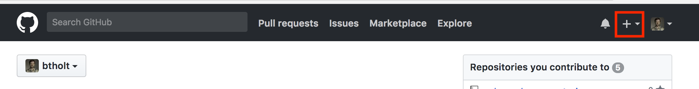

Coding is rarely a one-person job. Most frequently you are on a team of people, ranging from back end developers to designers and all of you are contributing to one project. As you may imagine, if you not careful, everyone ends up stepping on each others' toes.

This is what git is for.


Git is a distributed source control management tool. That's a fancy way of saying that it's an easy way to share code and work on it together with a large team. It's also a very convenient way to backup your code off your computer and an easy way for you to post code online so other people can use it.

We are going to interact with git from the terminal. If you're on Mac or Linux, just open your terminal.

If you're on Windows, either find a way to interact with the Linux subsystem or go download [git for Windows][windows]. Git for Windows is very bash-like so most of the commands we'll be using should just work. If you're using the Linux subsystem, everything will definitely work.

## bash

Open your terminal, let's get comfortable with navigating in bash. In bash, you're just navigating around the folders in your computer. You know how you use the File Finder (or whatever your operating system has) to find files and you click in and out-of folders? It's the same for bash, we're just using text commands to do it now.

### pwd

You should see a fairly empty screen. Type `pwd` and hit enter. `pwd` stands for "print working directory" (directory is synonymous with folder) and sure enough it prints where you are in your terminal. It's basically asking bash "where am I right now?" It should print something like: `/Users/<your user name here>`. This is probably your home directory. Every user on your computer has their own home directoy. Usually you want to be working out of here to keep things organized.

### ls

Now type `ls`. `ls` stands for "list". It lists everything in the directory. It'll show you a bunch of files and folders you can open or run. `ls` is like asking "what's here?" Try typing `ls -l`. You'll notice the same files and folders are being outputted but it's formatted in a different way. `-l` is what's called a **flag**. It's something that's passed to the `ls` program and it modifies what it does. In this case, `-l` means give us the long output. Try typing `ls -lah`. This will show you even more files because `-a` means show all files, including hidden files (which are the ones that start with a `.`) and it will show you the file sizes in more readable sizes because of `-h`.

If you forget what these means, [explainshell.com][es] is an extremely helpful site.

### man

Try `man ls`. `man` is short for manual. It'll pop up documentation for `ls` in case you forget you how to use it. Most things should have `man` pages but they're usually pretty verbose. When you want to quit, hit the `q` key.

### mkdir

Hopefully you're in your home directory right now. If not, type `cd ~` (I'll explain what that is in the next section.) Okay, now that we're here, type `mkdir webdev`. This will create a new directory (it stands for "make directory") and now you can type `ls` and see it.

### cd

Type `cd webdev`. This will move us from the home directory into the `webdev` folder we just created. Type `pwd` to see that we're inside the directory. Type `ls` to see that there's nothing inside the directory. Type `cd ..` to get out of this directory and back into your home directory. `..` means up one directory. Type `cd webdev` to get back into the directory.

### touch

Type `touch index.html`. `touch` creates an empty file where-ever you tell it to. Here we told it to create a file called `index.html` in this directory. If you type `ls` you'll see your new folder.

### code

If you're using VSCode as your editor, you can open VSCode directly from bash (most other editors have ways of doing this too.) [Follow the commands here][code]. Type `code index.html` to open _just_ that file, or type `code .` to open this whole directory as a project. The `.` means this directory, similar to how `..` means up one directory.

### vi

Oh boy. Here we go. Type `vi index.html`. This going to open vim which is an editor that's all in the command line. I definitely do not want too much into it but eventually you're going to accidentally to open it and you have to know how to close it. It also can be useful to quickly edit something.

vim has multiple "modes" you can enter. By default you start out in command mode. If type `i` you will enter insert mode. Now you can type. Enter "hello world" or something like that. Now hit your escape key. Now you're back in command mode. type `:q` and hit enter. This is how you'd typically quit but it won't let you since you have unsaved changes. You can either type `:w` and then `:q` to save your changes and quit (or just `:wq` to do both at once) or you can type `:q!` to quit without saving. vim is so much deeper and complicated than that but that's enough to make you dangerous.

### more bash

If you want more bash skills, please check out Jem Young's [Full Stack][fs] and [Full Stack 2][fs2].

## git

Okay, let's use Git now. Put something meaningful in your index.html you created, something like:

```htm
<!DOCTYPE html>
<html lang="en">

<head>
  <title>Git</title>
</head>

<body>
  <h1>Git Example</h1>
</body>

</html>
```

Doesn't matter really what it is. Now `cd` into your project.

### git init

Type `git init`. This begins a git project. If you type `ls -lah` you'll see that it creates a secret `.git` folder where it keeps track of everything (you don't have to look in there or do anything with it.)

### git status

Type `git status`. This will tell you that `index.html` is an untracked file.

The way git is organized is that you group you changes into what are called **commits**. A commit is one group of changes that are made permanent. A git repository will have many commits. Some will have just one commit, some will have many. As of May 12, 2018, the git repository for the Linux project has 753,310 commits. A commit is made up of all the changes, the differences between where the code was and where the code is now. This will add new files, remove old files, delete some lines in some files, and add lines in others.

So let's make our first commit in this repository.

### git add

The way you add files to a commit is that they have to go through two stages: being staged and then being committed. Type `git add index.html`. This will make index.html staged and ready to be committed. Type `git status` and it will show index.html as a change ready to be committed. You can also type `git add .` to make everything in this directory staged, or type `git add -A` to add everything _and_ include anything you deleted to also be deleted from the repo.

### git commit

Type `git commit -m "My first commit"`. It should tell you added your first commit. Type `git status` and it should tell you you haven't changed anything since last commit. The `-m` is important because each commit must have a message with it and it's best to say what you did in that commit, something like "fixed this bug" or "added this feature". If you forget the `-m` it'll probably throw you into vim, so be prepared!

### git log

Type `git log` now to see your commit immortalized in the git repository (or repo, which is what you call each git project.)

### more git

Git is so powerful. There are a lot of really cool features. Probably the biggest thing we didn't talk about here is merging code with others. See [Nina Zakharenko's course][nina] to become a git master. Some other basic functions you'll want to learn is how to `git pull`, `git clone`, `git merge`, `git rebase`, `git stash`, `git checkout`, and `git branch`. Those are the ones that are needed for base level proficiency in git.

### GitHub

If you have not already, please go sign up for a [GitHub][gh] account. GitHub is a centralized repository for git projects. It allows strangers across the world to collaborate on code and make cool stuff. It has become the modern developer's résumé. The code for this website is hosted on [GitHub][course] (feel free to star it if you're there!)

Many companies host their code there for all their various open and closed source projects. It's a cool way to browse other people's code and see how they do things. If you see a mistake, you can **fork** their code, which means make your own copy of and fix it yourself. Once fixed, you can open a **pull request** against it. A pull request (often abbreviated as **PR**) is a request for them to merge your commits in with theirs. They will then decide if they want to (since it's their repo) and will merge it or not.

Today, we're going to create our own repo.



Click the + (which I highlighted in red for you) in the nav and create a new repository. Name the new repo whatever you would like, do not add the license or README, and continue.

### git remote

Back to your terminal, navigate to your project using `cd` and write the following command: `git remote add origin <your project url here>`. Notice about half way down the page you can see that command, feel free to copy and paste that.

This command is going to add a new remote to your project called `origin`. A remote is somewhere for you to push your computer. If you use a GitHub-based flow (most of us do) this will be one of the very few remotes you'll ever use. Git can be used in a more decentralized way; you could have a remote that's your buddy's computer. But I've never worked that way. We called the remote "origin" but we could have called it anything. But everyone calls it origin. "origin" should always be called where _your_ repo is. Sometimes you'll fork someone else's code and keep track of that repo too, and typically you'd call that "upstream".

Type `git remote -v` and you should see your newly-added remote. It adds the remote twice because you can fetch (which is what you call when you pull code down) from one place and you can push (which is what you call when you send your code up) to another. I've never seen anyone do that though.

### git push

Okay, now that we're here, type `git push origin master`. `push` is the command to send your code up to GitHub. `origin` is the name of the remote that we just added. `master` is the name of the branch that we're on. Git has the ability to keep track of multiple branches of code so that you and your colleague can work on the same code at the same time but each keep your own copy. For now we're working out of the master branch which the main branch that everyone will eventually merge their code into. If you want more explaination, please take [Nina's class][nina].

### Messing around with GitHub

If you want to play around with GitHub, feel free to toy with [my pull-requests][pr] repo. It's there so you can fork it, file issues, and open pull requests to your heart's content.

### Your Projects

You've made two projects so far: the calculator and the News Times site. Put both of these up on GitHub in their own repos.

[windows]: https://gitforwindows.org/
[es]: https://explainshell.com/explain?cmd=ls+-lah
[code]: https://aka.ms/Mayv8z
[fs]: https://frontendmasters.com/courses/full-stack/
[fs2]: https://frontendmasters.com/courses/full-stack-v2/
[nina]: https://frontendmasters.com/courses/git-in-depth/
[gh]: https://github.com/
[course]: https://github.com/btholt/intro-to-web-dev-v2
[pr]: https://github.com/btholt/pull-requests
