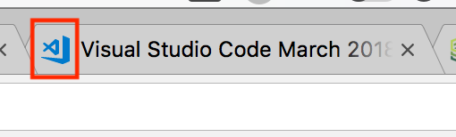

So far, we've been very focused on the browser. Historically this has been the purpose of JavaScript: make websites interactive. However as time has gone by, people have really embraced JavaScript as a language. An enterprising individual named Ryan Dahl wrote a connecting layer between Google Chrome's v8 engine, which is what actually runs JavaScript inside of Chrome, and the system. He called it Node.js (often just called Node) and the community just exploded with popularity.

You should have installed Node in our previous lesson. If you haven't, [do so here][node].

Parcel, the bundler tool used in the previous lesson, is written using Node. Node lets us execute JavaScript outside of the browser. In that case, it's using JavaScript to write a tool that bundles together the code we write so we can serve it to a user. We're going to use it to write server code. Going back to our house example from earlier, we're going to create our own pizza place that will respond to all the houses/clients that request pizza/data. It's important to keep that relationship in mind: one server serves many clients, even if in this case we're just going to be serving ourselves.

The most basic server in Node is only just a couple of lines. Let's give it a shot. Start a new project, and add a file called server.js.

```js
const http = require("http");

const server = http.createServer(function(req, res) {
  console.log(`user visited ${req.url}`);
  res.end("hello!");
});

console.log("listening on http://localhost:3000");
server.listen(3000);
```

Go to your terminal and run `node server.js`. You should see the "listening on http://localhost:3000" message logged out. Navigate your browser to http://localhost:3000. You should see the text `hello!` responded back to you. Look at your terminal and it should show two requests, one for `/` and one for `/favicon.ico`. The `/` represents the base, home page that you requested by going to the bare domain `localhost:3000`. If you went to http://localhost:3000/lol then you'd see `/lol` there (you can actually try that if you want to.) The `/favicon.ico` request is the browser trying to get the favicon which is that little icon that the browser puts on the browser tab.



The browser just knows to look for it at that URL. In our case we're not serving an image for that (it's also just seeing the `hello!` text) so nothing is displayed there.

So let's unpack our Node server a bit more.

* Node is still using CommonJS for its modules (the old way of doing it that we refactored before.) That's why we're using `require`.
* We require in the `http` module which is a module baked into Node. This is the module that we use to do all the necessary communication to be able to run a web server. Think of this like the phone at the pizza place. It allows us to listen to requests and then respond to them.
* The `http.createServer` method does exactly what you think it does: it creates a server! It takes a function as a callback, and this function will be run every time a user makes a request to that server.
* The function has two parameters: `req` (request) and `res` (response).
  * The `req` parameter represents all the information coming from the user. You can see what URL they used to request, what parameters they sent you, what headers (headers are meta data that your browser sends with each request, like if you want the response to be in English, Spanish, etc.) they used, etc.
  * The `res` paramenters represents what you want to send back for the request. Here you can set your own headers, set cookies (cookies are bits of information that the client and server pass back-and-forth to each other so you can keep track of who the client is,) the HTTP status code (404 is a status code that means not found; there are many like 200, 302, 403, 500, etc.), and what the response body should be.
  * `res.end()` has to be called at the end to let the server know you're done. Since you _could_ do asynchronous things before you respond, it requires you to let it know "yes, I'm done now". If you give `end` text, it'll respond to the user with that.
  * `server.listen` is how you tell the server to actually start up and start listening for requests. `3000` represents the port we're listening in. Remember how Parcel listens on 1234? We chose to listen on 3000. It doesn't matter what number we choose (as long as you're above 1024, the explanation is pretty boring and technical; [see here][so])

Cool! This is a pretty boring server. Let's make it more interesting. Working with the `http` module directly can be a bit tedious and reinventing the wheel. It's very low-level. There are some frameworks built on top of it that make it a lot easier to deal with. We're going to teach you one called [Express][express] that makes it a lot easier to work with without being too complicated.

1. In the folder where you made server.js, run `npm init -y` to generate your package.json
1. Run `npm install express`
1. Change your server to look like this

```js
const express = require("express");

const app = express();

app.get("/", function(req, res) {
  res.end("Welcome to my site!");
});

app.get("/complement", function(req, res) {
  res.end("You look nice today");
});

app.listen(3000);
console.log("listening on http://localhost:3000");
```

Looks pretty similar, right? Express is pretty thin (doesn't do _too_ much) which is great. Let's break it down.

* `const app = express();` is how you create a new server.
* `app.get(url, callback);` is how you handle a new route. A route is how you handle the request when a user hits a particular URL. In this case we set up two, the default home page, `/`, and `/complement`. Try visiting both `http://localhost:3000` and `http://localhost:3000/complement`. If you try a different URL from those, it'll give a 404 not found error.

Otherwise it's pretty similar, right? Let's go one step further and make it serve a front end. Make a new folder in your project called `public`. Every file we put in here we're going to serve publically so don't put anything sensitive in here (like passwords or access keys.) Make a file called `complements.js` in this public folder.

```js
document
  .querySelector(".request-complement")
  .addEventListener("click", function() {
    fetch("/complement")
      .then(function(res) {
        return res.json();
      })
      .then(function(data) {
        document.querySelector(".complement").innerText = data.complement;
      })
      .catch(function(err) {
        console.error(err);
      });
  });
```

Mostly nothing new here. The `/complement` path means it's going to request it from the same server that this was served from. In this case it'd be http://localhost:3000/complement

Make new index.html in the root directory of this project (where server.js and package.json are.) Put in it:

```htm
<!DOCTYPE html>
<html lang="en">

<head>
  <title>Complements</title>
</head>

<body>
  <h1>Complements!</h1>
  <p class="complement">none loaded yet</p>
  <button class="request-complement">Request New Complement</button>
  <script src="./public/complements.js"></script>
</body>

</html>
```

Nothing new here either. Notice we are requesting the complements.js file from the public directory.

Refactor (a word which means rework your code) your server.js file to look like:

```js
const express = require("express");
const path = require("path");

const complements = [
  "You like nice today",
  "That dress looks nice on you",
  "Have you been working out?",
  "You can do hard things",
  "You've gotten far in this course. You're really smart",
  "You're programming! How cool is that?",
  "I'm really proud of you",
  "You made this",
  "You've learned a lot of things, and that's pretty hard to do"
];

function getRandomComplement() {
  const randomIndex = Math.floor(Math.random() * complements.length);
  return complements[randomIndex];
}

const app = express();

app.get("/", function(req, res) {
  res.sendFile(path.join(__dirname, "index.html"));
});

app.get("/complement", function(req, res) {
  res
    .json({
      complement: getRandomComplement()
    })
    .end();
});

app.use("/public", express.static("./public"));

app.listen(3000);
console.log("listening on http://localhost:3000");
```

Alright! A bit here but let's work it out!

* The `getRandomComplement` function returns a random item from the `complements` array. `Math.random()` gives you a random number between 0 and 1. We take that and multiply that by how long the `complements` array is (which is cool because we can add and subtract items from the `complements` array and not change this function). This is basically the same as saying we're going take a 0%-100% randomly of the array length. We'll end up with a number like `2.16231583252359`. We need that to be a whole number so it's a useful index, so we say `Math.floor()` which gives us that number rounding down, so `Math.floor(3.9)` is 3 (there's also `Math.ceil` to round up and `Math.round` to round how we normally do.) The result is we get a random number between 0 (the first element of an element array) and `complements.length - 1` (the last element of the array). We then use that to return a random element from `complements`!
* `res.sendFile(path.join(__dirname, "index.html"));` sends the user the `index.html` we just created. `path` is a libray for getting correct file locations. In this case, we're getting the whole path to it so Express can find it. `__dirname` is a special Node variable that's the folder of where the server.js file is. We know that index.html is in the same folder, so we're saying serve the index.html file found in the same directory as server.js.
* `res.json({ complement: getRandomComplement() }).end();` - This is going to respond to the request with a `JSON` object, just like dog.ceo was doing. It's going to be a small object with just one key: `complement`. The value to that key is going to be one of the random complements generated by that function.
* `app.use("/public", express.static("./public"));` serves everything in the public directory publicly. We'll put stuff in here like images, client JS files, CSS files, and anything else we need users to be able to download from our server. Part of what this does is set all the correct headers which you need to do. The browser will request a resource like `my-styles.css` but the browser needs to know how to read that file: is it an image or is it a CSS file? (it doesn't look at the file extension). It then serves everything inside it from the path on the server `/public`. We happened to call the folder and the path from the server the same thing but you don't have to (though it's smart to.)

That's it! You made your own full web app!

### Extend this project

* Add it to GitHub in its own repo
* Make an `/insult` endpoint that returns random insults to be hurled at your foes. Add another button to be able to request insults on your page.
* Use Parcel and PopMotion to animate your page. Parcel has a `parcel build index.html` [see here][build] command that you could have it build your project into your `public` folder.
* Style the whole page nicely using CSS! Put your CSS in your public folder and include it the `<head></head>` of your index.html

[node]: https://nodejs.org/
[so]: https://unix.stackexchange.com/questions/16564/why-are-the-first-1024-ports-restricted-to-the-root-user-only
[express]: https://expressjs.com/
[build]: https://parceljs.org/cli.html#build
