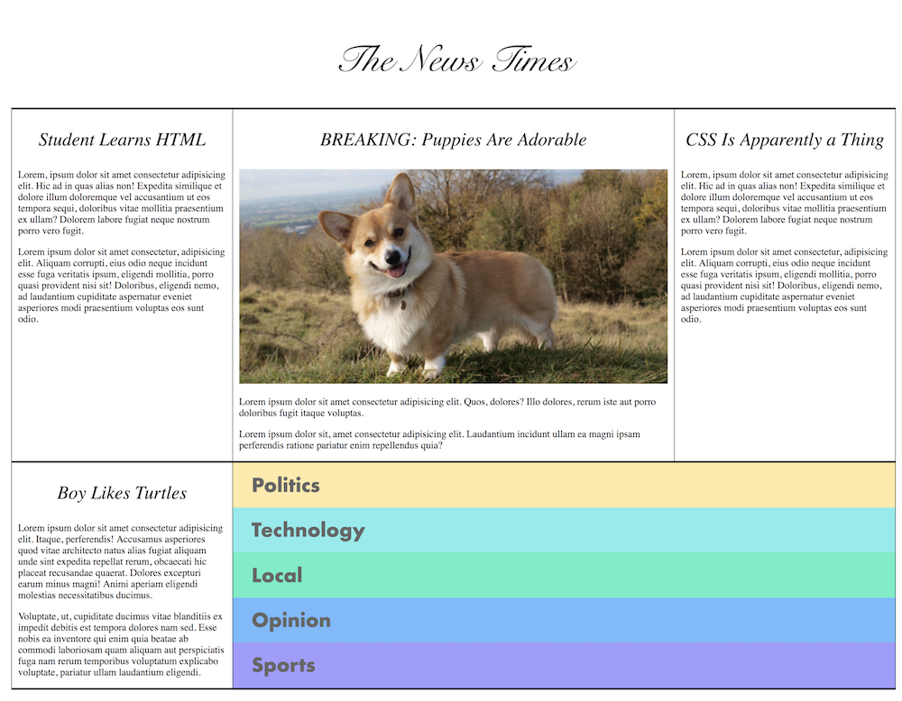

We're going to work on a project together to work on your HTML and CSS skills and so you can see how these puzzle pieces fit together. We are going to make a news site together, similar to The New York Times. Your project will look like this:

You don't have to get it exact. The point here is for you to break down this layout into smaller pieces and solve the smaller problems before piecing it back together into this.

[Here is my complete version](/intro-to-web-dev-v2/news.html)

Here are some tips and guidelines:

* Google everything. No one expects you to remember these things off the top of your head. It's not cheating. This is not an exam. Knowing how to Google programming things is literally your job.
* The image is coming from a site called [placecorgi.com][pc]. The key here is that it'll give you images of any size. The way you do that is http://placecorgi.com/ `<width>` / `<height>` where your replace width and height with a number. This will be the size of your image in pixels. The one in my example is http://placecorgi.com/500/300
* Do the navigation box (with all the colors) last. It's the hardest part. It uses `display: flex` inside of `display: flex` and uses `flex` and `flex-direction`.
* The top row and the bottom row are using `display: flex` to manage the size of those columns. They both use the same class.
* There's a lot of room to re use classes on this.
* Please, please take it one step at a time. Take one section on the page, style it, and then use those small building blocks to make larger building blocks.
* You can "cheat" by looking at what I did and inspecting the page. I'd try to build it first on your own but then take a look at how I'm doing it.
* How I solved it is not the "correct" answer. That's like saying there's a correct way to write a poem or a correct way to paint a portrait. This is as much art as it is science.
* Good luck!

[pc]: http://placecorgi.com/
